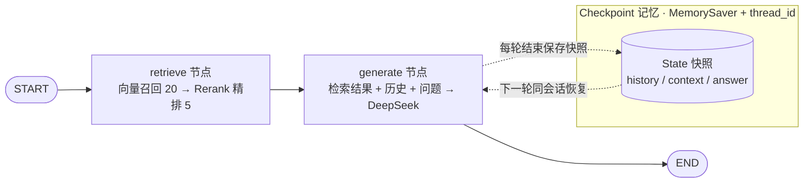
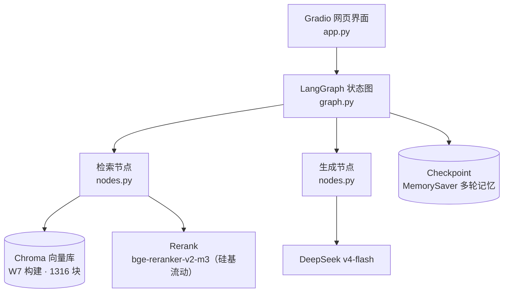

# W8 · LangGraph 单 Agent + 网页界面

年报问答 Agent 的 LangGraph 版：把「检索 → 回答」做成显式状态图，并套上 Gradio 网页界面。
复用 W7_RAG 的向量库（Chroma，1316 个文本块）、重排与 DeepSeek 封装。

## 运行

```powershell
cd E:\mini_agent\W8_LangGraph
python app.py
```

## 状态流转图



## 系统架构图



## 演示截图

（待补充）
